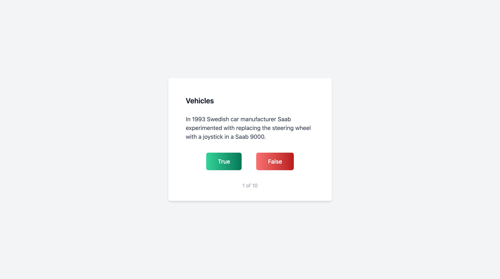

# General Knowledge Quiz

A general knowledge quiz that presents random true or false questions.

## Description

A general knowledge quiz that presents random true or false questions from different categories and a summary of your results. 

The back-end acts as a proxy server that is responsible for making requests to an external API and formatting the response.

## Technologies

- TypeScript.
- React.
- Node.
- Epxress.

## Motivation

This was a learning project to deepen my understanding of using TypeScript in Node and React.

### Available Scripts

#### Client

In the project directory, you can run:

##### `npm start`

Runs the app in the development mode.\
Open [http://localhost:3000](http://localhost:3000) to view it in the browser.

The page will reload if you make edits.\
You will also see any lint errors in the console.

##### `npm test`

Launches the test runner in the interactive watch mode.\
See the section about [running tests](https://facebook.github.io/create-react-app/docs/running-tests) for more information.

##### `npm run build`

Builds the app for production to the `build` folder.\
It correctly bundles React in production mode and optimizes the build for the best performance.

The build is minified and the filenames include the hashes.\
Your app is ready to be deployed!

See the section about [deployment](https://facebook.github.io/create-react-app/docs/deployment) for more information.

#### Server

In the project directory, you can run:

##### `npm start`

Starts the server.
