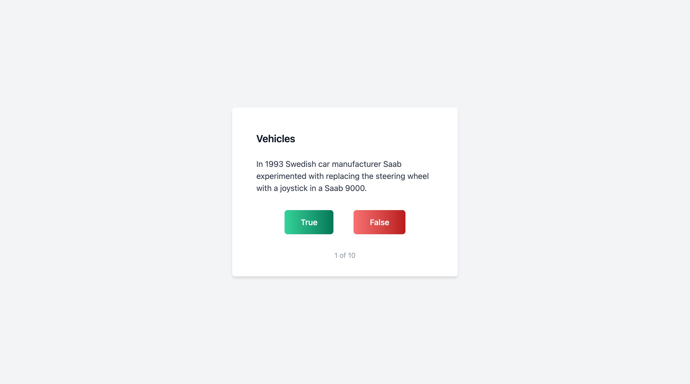

# Quiz

A general knowledge quiz application to present true or false questions and display a summary of results, built with React.

## Description

This is an application which allows you answer random true or false general knowledge questions from different categories and view a summary of your results.

## Motivation

I built this application to practice using TypeScript in React and to build a fun application.

### Available Scripts

#### Client

In the project directory, you can run:

##### `npm start`

Runs the app in the development mode.\
Open [http://localhost:3000](http://localhost:3000) to view it in the browser.

The page will reload if you make edits.\
You will also see any lint errors in the console.

##### `npm test`

Launches the test runner in the interactive watch mode.\
See the section about [running tests](https://facebook.github.io/create-react-app/docs/running-tests) for more information.

##### `npm run build`

Builds the app for production to the `build` folder.\
It correctly bundles React in production mode and optimizes the build for the best performance.

The build is minified and the filenames include the hashes.\
Your app is ready to be deployed!

See the section about [deployment](https://facebook.github.io/create-react-app/docs/deployment) for more information.

#### Server

In the project directory, you can run:

##### `npm start`

Starts the server.\
